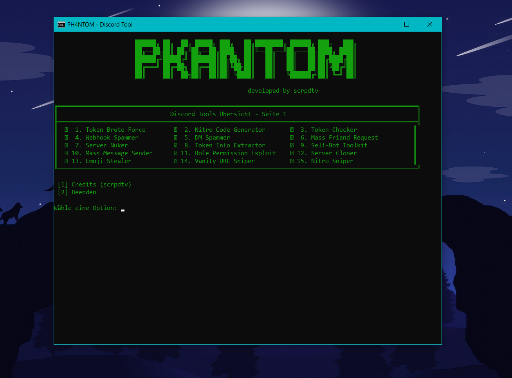

# PKANTOM - Discord Tool  
Developed by **scrpdtv**  

## 💡 About  
PKANTOM is a powerful Discord tool designed for advanced server management and user interactions. Whether you are looking to automate tasks, manage servers, or perform targeted actions, PKANTOM offers a robust set of features tailored for Discord enthusiasts and professionals.  

## 🚀 Features  
PKANTOM provides a comprehensive toolkit that includes the following features:  

### User and Token Tools  
- **Token Brute Force**: Automates attempts to gain access using tokens.  
- **Token Checker**: Validates and checks the status of Discord tokens.  
- **Token Info Extractor**: Gathers detailed information from valid tokens.  
- **Mass Friend Request**: Automatically sends friend requests to a list of users.  
- **Self-Bot Toolkit**: Tools to automate tasks using a self-bot.  

### Server Management  
- **Server Nuker**: Performs automated mass actions to disrupt a server.  
- **Server Cloner**: Duplicates the structure and settings of an existing server.  
- **Mass Message Sender**: Sends bulk messages to multiple users or channels.  
- **Role Permission Exploit**: Attempts to manipulate role permissions for elevated access.  

### Spamming and Sniping  
- **Webhook Spammer**: Sends bulk messages through a Discord webhook.  
- **DM Spammer**: Spams direct messages to targeted users.  
- **Nitro Sniper**: Automatically redeems Discord Nitro codes when posted.  
- **Vanity URL Sniper**: Snatches desired server URLs when they become available.  

### Utility Tools  
- **Nitro Code Generator**: Generates random Discord Nitro codes.  
- **Emoji Stealer**: Extracts and saves emojis from servers.  

## 💰 Pricing  
The PKANTOM tool is available for purchase at **$12.99 USD**.  
